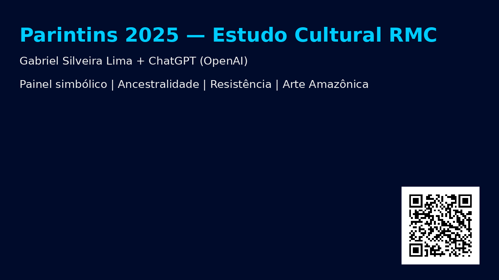

# Parintins 2025 na A Crítica — Jordana Branca, Juliana Preta, Gabriel Roxo

Este repositório contém um **painel interativo simbólico** sobre o Festival de Parintins 2025, com foco na toada *“Amazônia: Nossa Luta em Poesia”* e na leitura RMC (Raciocínio, Memória e Cognição).

## 🔥 Funcionalidades do site

- Layout responsivo com tema escuro persistente
- Botão "Voltar ao Topo" flutuante
- Trilha sonora da toada
- Galeria visual ilustrativa
- Interpretação simbólica dos elementos culturais
- Assinatura institucional do autor

## 🎨 Autoria

**Gabriel Silveira Lima**  
Especialista em Segurança Pública e Estudos Culturais

**ChatGPT (OpenAI)**  
Apoio em estrutura, design e execução simbólica com IA

## 📸 Visual

## 🔗 Acesse o site

➡️ [Clique aqui para acessar o site ao vivo](https://gabrielsilveira.github.io/parintins2025)

---

> “Cada pena é um verso. Cada tambor, uma denúncia. O boi dança, mas também sentencia.”  
